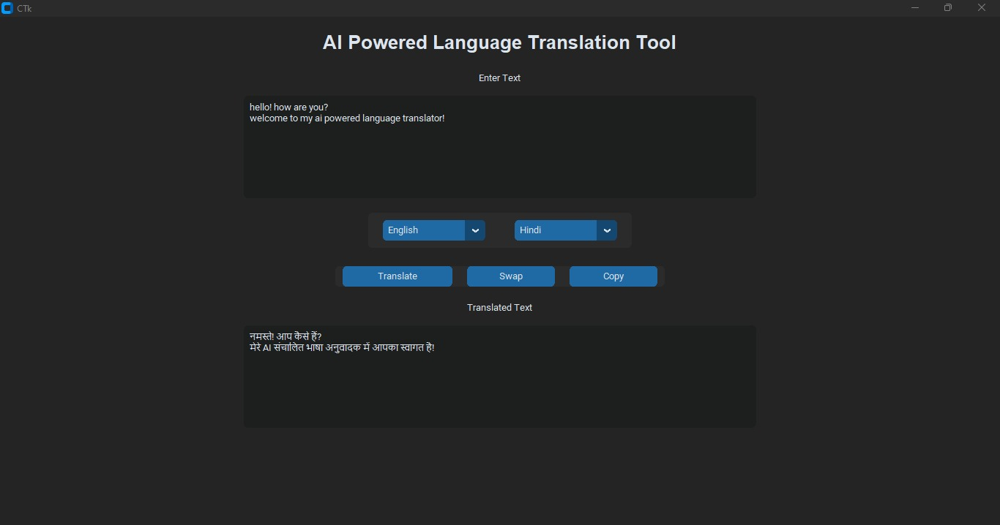
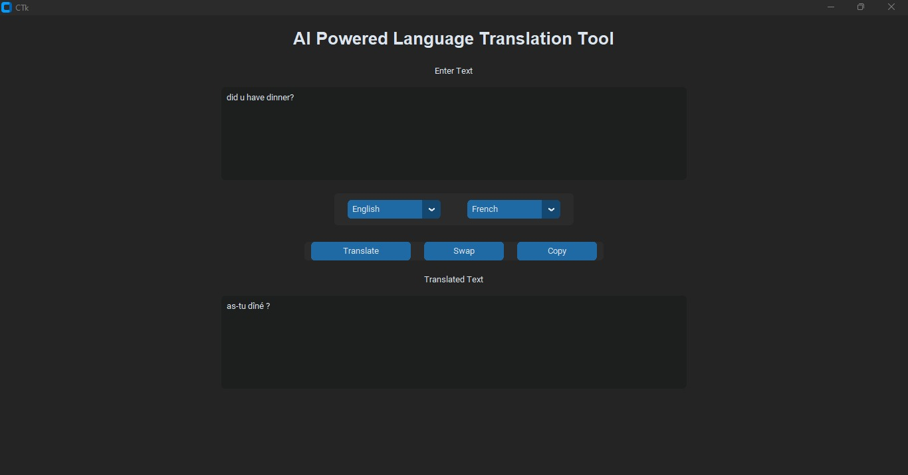

<p align="center">
  <h1 align="center">🌍 Multilingual Language Translator</h1>
</p>

<p align="center">
  <b>Translate text seamlessly across multiple languages with a modern AI-powered desktop interface.</b>
</p>

<p align="center">
  Built using Python • CustomTkinter • Deep Translator
</p>

---

## ✨ Overview

Language barriers shouldn't limit communication.

This project is a multilingual desktop translation tool that enables users to instantly translate text between multiple languages through a clean and interactive interface. The application supports language selection, real-time translation, language swapping, and clipboard copying for improved usability.

---

## 🚀 Features

🔹 Real-time text translation

🔹 Support for multiple languages

🔹 Interactive and modern GUI

🔹 Language swap functionality

🔹 Copy translated text with one click

🔹 Lightweight and easy to use

🔹 Powered by Google Translation Services

---

## 🌐 Supported Languages

| Language | Code  |
| -------- | ----- |
| English  | en    |
| Hindi    | hi    |
| French   | fr    |
| German   | de    |
| Spanish  | es    |
| Marathi  | mr    |
| Italian  | it    |
| Japanese | ja    |
| Korean   | ko    |
| Chinese  | zh-cn |
| Russian  | ru    |
| Arabic   | ar    |

---

## 📸 Application Demo

### English → Hindi Translation



### English → French Translation



---

## ⚙️ How It Works

```text
User Input
     │
     ▼
Language Selection
     │
     ▼
Google Translator API
     │
     ▼
Translated Output
     │
     ▼
Copy / Reuse Result
```

---

## 🛠️ Tech Stack

| Technology        | Purpose              |
| ----------------- | -------------------- |
| Python            | Core Programming     |
| CustomTkinter     | Desktop GUI          |
| Deep Translator   | Language Translation |
| Google Translator | Translation Engine   |

---

## 📂 Project Structure

```text
multilingual-language-translator/
│
├── translator_app.py
├── test_translation.py
├── requirements.txt
├── translator-demo1.jpeg
├── translator-demo2.jpeg
└── README.md
```

---

## 🚀 Installation

Clone the repository:

```bash
git clone https://github.com/Madhura-Malap/Multilingual-Language-Translator.git
```

Install dependencies:

```bash
pip install -r requirements.txt
```

Run the application:

```bash
python translator_app.py
```

---

## 🔮 Future Enhancements

🎤 Voice-to-Text Translation

🔊 Text-to-Speech Output

📄 Document Translation

📱 Mobile Application Version

☁️ Cloud Deployment

🤖 Context-Aware AI Translation

🌍 Support for Additional Languages

---

## 💡 Learning Outcomes

Through this project, I gained practical experience in:

* GUI Development with CustomTkinter
* API Integration
* Multilingual Text Processing
* User Interface Design
* Python Application Development
* Translation Systems

---

## 👩‍💻 Author

### Madhura Malap

Computer Science Engineering Student | Aspiring AI/ML Engineer
